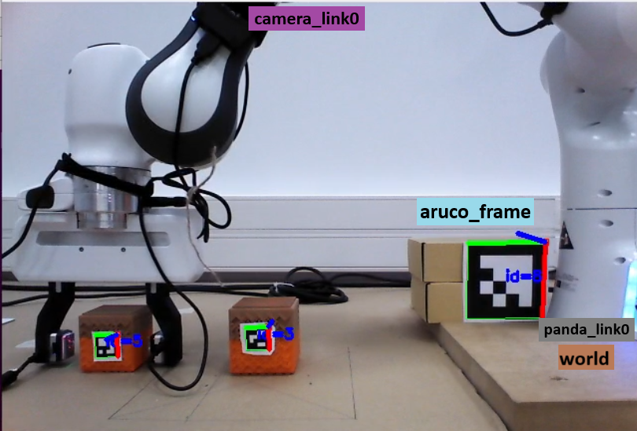

# Percepción visual de objetos para tareas de manipulación colaborativas
## TFG: Grado de Ingeniería Informática en la Universidad de Santiago de Compostela.
La industria impulsa el crecimiento económico de un paı́s, por lo que su evolución es
crucial. Las innovaciones recientes se basan en la integración de nuevas tecnologı́as que
mejoran los resultados y aumentan la productividad. En todo esto, los brazos colabora-
tivos o cobots están teniendo un gran impacto por su flexibilidad a la hora de trabajar
con operadores humanos y su gran adaptabilidad a diversas tareas. Por todo esto, y con
la finalidad de investigar el funcionamiento de nuevas tecnologı́as, se ha diseñado un sis-
tema que integra un brazo colaborativo Franka Panda, un sensor táctil GelSight Mini,
y marcadores Aruco reconocidos a través de una cámara Orbbec Astra. Todo el proceso
de integración viene acompañado de retos y dificultades como la calibración del Gelsight
Mini o la transformación de coordenadas entre diferentes sistemas de referencia. Todo di-
señado y desarrollado con la finalidad de poder percibir y manipular objetos de diferentes
tamaños y materiales a través de un brazo robótico, que, posteriormente, se podrı́a incor-
porar a una lı́nea de producción o a entornos industriales. Además, una vez obtenidos los
resultados, se plantean posibles ampliaciones y mejoras que complementarı́an al sistema.




### Preparación del Entorno
#### Sistema Operativo
El ordenador necesita Ubuntu 20.04 LTS con parche RealTime que tiene menos latencia en la comunicación de paquetes y es necesaria para conectarse al robot Franka Panda.
#### ROS
Se necesita Ubuntu 20.04 para poder instalar la distro  <a href="https://wiki.ros.org/noetic/Installation/Ubuntu">  ROS Noetic</a>  a través de los siguientes comandos:
```bash
# Configurar las fuentes del sistema
sudo sh -c 'echo "deb http://packages.ros.org/ros/ubuntu $(lsb_release -sc) main" > /etc/apt/sources.list.d/ros-latest.list'

# Configurar las claves
sudo apt update
sudo apt install curl # Si no tienes curl instalado
curl -s https://raw.githubusercontent.com/ros/rosdistro/master/ros.asc | sudo apt-key add -

# Actualizar el índice de paquetes
sudo apt update

# Instalar ROS Noetic
sudo apt install ros-noetic-desktop-full

# Inicializar rosdep
sudo rosdep init
rosdep update

# Configurar el entorno
echo "source /opt/ros/noetic/setup.bash" >> ~/.bashrc
source ~/.bashrc

# Instalar dependencias adicionales para compilar paquetes
sudo apt install python3-rosinstall python3-rosinstall-generator python3-wstool build-essential

# Verificar la instalación
roscore
```
#### MoveIt
Una vez instalado ROS Noetic, se pueden descargar los paquetes de MoveIt1 <a href="https://moveit.github.io/moveit_tutorials/doc/getting_started/getting_started.html"> MoveIt Getting Started</a>. MoveIt  facilita el control de  robots, se pueden ver los robots compatibles en <a href="https://moveit.ros.org/robots/">MoveIt: Robots</a>
```bash
# Instalar MoveIt
sudo apt install ros-noetic-moveit

# Actualizar e instalar dependencias
rosdep update
sudo apt update
sudo apt install ros-noetic-catkin python3-catkin-tools
sudo apt install python3-wstool

#Crear un workspace si no tienes uno
mkdir -p ~/ws_moveit/src
cd ~/ws_moveit/src
wstool init .
wstool merge -t . https://raw.githubusercontent.com/moveit/moveit/master/moveit.rosinstall
wstool update -t .
rosdep install -y --from-paths . --ignore-src --rosdistro noetic

#Compilar los paquetes
cd ~/ws_moveit
catkin config --extend /opt/ros/noetic --cmake-args -DCMAKE_BUILD_TYPE=Release
catkin build

# Verificar la instalación
roslaunch panda_moveit_config demo.launch rviz_tutorial:=true

```
#### Astra 
Una vez instalado ROS Noetic, se puede descargar los paquetes de la cámara Astra siguiendo los pasos del repositorio <a href="https://github.com/orbbec/ros_astra_camera">Astra ROS</a>

```bash
# Asumiendo que has configurado el entorno de ROS, lo mismo aplica abajo
sudo apt install libgflags-dev ros-noetic-image-geometry ros-noetic-camera-info-manager ros-noetic-image-transport ros-noetic-image-publisher libusb-1.0-0-dev libeigen3-dev

# Instalación de libuvc
git clone https://github.com/libuvc/libuvc.git
cd libuvc
mkdir build && cd build
cmake .. && make -j4
sudo make install
sudo ldconfig

#Crear un workspace si no tienes uno
mkdir -p ~/ros_ws/src
cd ~/ros_ws/src

#Descargar paquetes
git clone https://github.com/orbbec/ros_astra_camera.git

#Compilar
catkin_make

#Instalar udevrules
cd ~/ros_ws
source ./devel/setup.bash
roscd astra_camera
./scripts/create_udev_rules
sudo udevadm control --reload && sudo  udevadm trigger

# Verificar la instalación
source ./devel/setup.bash 
roslaunch astra_camera astra.launch
```

#### Paquetes de python
Además se necesitan algunos paquetes de python específicos. Como no estoy seguro si ya se descargan en alguna dependencia, incluyo paquetes por exceso. Algunos de estos paquetes se instalan por apt con ROS y otros mediante el gestor de python pip. La librería Aruco ya esta integrada en opencv y en el sistema se utiliza el diccionario `DICT_4X4_50`.

```bash
# Activar tu entorno de ROS
source /opt/ros/noetic/setup.bash

# Instalar paquetes de ROS necesarios
sudo apt install ros-noetic-rospy ros-noetic-actionlib ros-noetic-std-msgs ros-noetic-tf2-ros ros-noetic-tf2-geometry-msgs ros-noetic-geometry-msgs ros-noetic-tf ros-noetic-moveit-commander ros-noetic-moveit-msgs ros-noetic-trajectory-msgs ros-noetic-franka-gripper

pip install opencv-python numpy rospy actionlib std_msgs panda_demo curses tf2_ros tf2_geometry_msgs geometry_msgs tf moveit_commander moveit_msgs trajectory_msgs franka_gripper six
```

#### Calibracion de la Cámara
En el nodo aurco_detector se utilizan los parámetros intrínsecos de la cámara. Para ello se realiza una calibración y se alamacena en `ws_davidpacios/src/movement_davidpacios/camera/rgb_camera.yaml` respetando el nombre. Este fichero se puede generar automáticamente con la siguiente guía <a href="http://www.yahboom.net/public/upload/upload-html/1641547558/Astra%20camera%20calibration.html">Calibración Camara Ros</a>

```bash
#Cargar setup de ROS
cd ~/ros_ws
source ./devel/setup.bash

#Lanzar los controladores de la cámara
roslaunch astra_camera astra.launch

#Lanzar el programa de calibración con los parámetros adecuados (MUY IMPORTANTE: los square son los vértices de los cuadrados interiores,es decir, número de filas - 1 x número de columnas - 1)
rosrun camera_calibration cameracalibrator.py image:=/camera/color/image_raw camera:=/camera/camera --size 8x6 --square 0.0245
```

### Ejecución: Pick and Place DPV
Para comenzar la ejecución del sistema, hay que segurarse de conectar todos los dispositivos: Gelsigh Mini y Cámara Astra en puertos 3.0 y que el robot Franka este en la interfaz de red correcta. Además, la cámara debe estar en una posición donde pueda decetar el Aruco de referencia, está definido en el sistema con id igual a 8 y un objeto con su marcador Aruco correspondidnte para poder comenzar a hacer las transformaciones y inicializar el resto del sistema. Para iniciar el sistema se cargan dos launchers, uno para iniciar los controladores y otro para iniciar los diferentes nodos del sistema:
```bash
#Iniciar los controladores (Cámara Astra y Robot Franka) del sistema:
roslaunch movement_davidpacios sensor_franka.launch
#Iniciar los nodos del sistema, entre ellos la interfaz gráfica
roslaunch movement_davidpacios pick_and_place.launch
```


